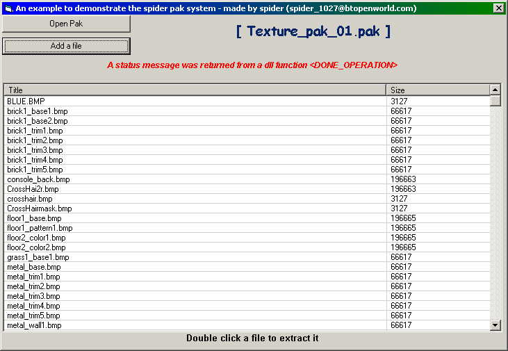



## Pak System & example of how to use dll's

### Description

This is a dll that handles file control into a pak system like quake3 and other games. The files are imported one after another in a "pak" file. If you want to retrieve a file all you have to do is call extract_file with the filename and path you want it to goto.

The dll (included) has the following functions:

EXTRACT_FILE

OPENPAK

RETURN_NUM_LOADED

RETURN_SIZE

RETURN_TITLE

and an example project on how to use the dll is also included.
 
### More Info
 

             |
---                |---
**Submitted On**   |2003-07-24 13:05:18
**By**             |[Spider678](https://github.com/Planet-Source-Code/PSCIndex/blob/master/ByAuthor/spider678.md)
**Level**          |Advanced
**User Rating**    |4.7 (14 globes from 3 users)
**Compatibility**  |VB 3\.0, VB 4\.0 \(16\-bit\), VB 4\.0 \(32\-bit\), VB 5\.0, VB 6\.0
**Category**       |[Files/ File Controls/ Input/ Output](https://github.com/Planet-Source-Code/PSCIndex/blob/master/ByCategory/files-file-controls-input-output__1-3.md)
**World**          |[Visual Basic](https://github.com/Planet-Source-Code/PSCIndex/blob/master/ByWorld/visual-basic.md)
**Archive File**   |[Pak\_System1619517242003\.zip](https://github.com/Planet-Source-Code/spider678-pak-system-example-of-how-to-use-dll-s__1-47145/archive/master.zip)

